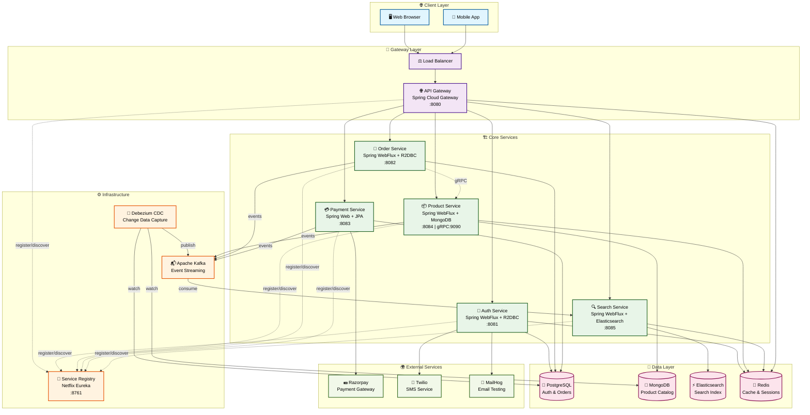

Synapse is a cutting-edge, fully reactive, event-driven e-commerce platform built on a robust microservices architecture. It demonstrates a modern approach to building scalable, resilient, and maintainable enterprise-level applications using Kotlin and the Spring ecosystem.

This project is not just a proof-of-concept; it's a comprehensive backend solution that covers everything from user authentication and product management to complex order processing and advanced search capabilities.

# ✨ Core Features
This platform is packed with features that showcase modern software engineering best practices:
* **Completely Reactive Stack**: Built from the ground up with Spring WebFlux, Project Reactor, and R2DBC for a non-blocking, high-performance, and scalable system.
* **Event-Driven Architecture**: Services are decoupled and communicate asynchronously via Apache Kafka, ensuring high resilience and scalability.
* **Secure by Design**:
  * Authentication & Authorization: JWT-based security with roles and permissions managed by Spring Security.
  * Two-Factor Authentication (2FA/MFA): TOTP-based 2FA for enhanced user security, complete with QR code generation.
  * Secure Key Management: JWT signing keys are stored securely in a Java Keystore (JCEKS).
* Advanced Product & Search:
  * Full-text, faceted search powered by Elasticsearch.
  * Real-time index updates via Kafka events from the Product service.
  * Features like "similar products" and "popular search trends."
* Robust Data Management:
  * Polyglot Persistence: Utilizes the best database for the job (PostgreSQL for transactional data, MongoDB for flexible product catalogs).
  * Reliable Eventing: Implements the Outbox Pattern to guarantee atomic writes to the database and event publishing to Kafka.
  * Change Data Capture (CDC): Debezium is configured to stream database changes directly to Kafka, enabling real-time data synchronization across the system.
* Cloud-Native Architecture:
  * Service Discovery: Netflix Eureka for dynamic service registration and discovery.
  * Centralized API Gateway: A single entry point for all clients, handling routing, rate limiting (with Redis), and API composition.
  * Containerized: Fully containerized with Docker and easily orchestrated with Docker Compose for seamless setup and deployment.
* Third-Party Integrations:
  * Payments: Integrated with Razorpay for payment processing, including secure webhook handling.
  * Communication: Twilio integration for sending OTPs via SMS.

# 🏛️ System Architecture

Synapse employs a classic microservices architecture where each service has a distinct responsibility, its own database, and communicates via a message bus or direct calls through the service registry.
Architectural Flow:
* All external requests are routed through the API Gateway.
* The Gateway discovers service locations from the Eureka Registry.
* Requests are forwarded to the appropriate downstream microservice.
* Services communicate with each other asynchronously via Kafka for events (e.g., ProductCreated) or synchronously via gRPC (e.g., Order service validating a product).
* Data is persisted in dedicated databases (PostgreSQL or MongoDB).
* Debezium captures database changes and publishes them to Kafka, which are then consumed by services like Search Service to update the Elasticsearch index.



# Microservices Overview

| Service Name     | Description                                                                                          | Technologies Used                                  | Database      |
|------------------|------------------------------------------------------------------------------------------------------|----------------------------------------------------|---------------|
| Gateway Service  | The single entry point. Handles API routing, rate limiting, and aggregates API documentation.        | Spring Cloud Gateway, WebFlux, Eureka, Redis       | -             |
| Registry Service | Provides service discovery and registration for all microservices.                                   | 	Spring Cloud Netflix Eureka                       | -             |
| Auth Service     | Manages user registration, login, JWT generation, MFA, email verification, and password reset.       | Spring WebFlux, Spring Security, R2DBC, JWT, Redis | PostgreSQL    |
| Product Service  | Core of the catalog. Manages products, categories, brands, sellers, and inventory. Publishes events. | Spring WebFlux, Reactive MongoDB, Kafka, gRPC      | MongoDB       |
| Order Service    | Handles order creation, validation, and processing. Communicates with Product Service via gRPC.      | Spring WebFlux, R2DBC, gRPC, Kafka                 | PostgreSQL    |
| Payment Service  | Integrates with Razorpay for handling payments and processes payment status updates via webhooks.    | Spring Web, JPA, Kafka, Razorpay SDK               | PostgreSQL    |
| Search Service   | Consumes Kafka events to provide powerful, real-time search capabilities for products.               | Spring WebFlux, Reactive Elasticsearch, Kafka      | Elasticsearch |

# 🛠️ Technology Stack

This project utilizes a modern, robust, and scalable technology stack.

| Category             | Technologies                                                                                      |
|----------------------|---------------------------------------------------------------------------------------------------|
| Language & Framework | 	Kotlin, Spring Boot 3, Spring WebFlux, Spring Security, Spring Data (R2DBC, JPA, Reactive), gRPC |
| Databases & Caching  | 	PostgreSQL, MongoDB, Elasticsearch, Redis                                                        |
| Messaging & Events   | 	Apache Kafka, Debezium (for CDC)                                                                 |
| Architecture         | 	Microservices, Event-Driven, REST APIs, Docker, Docker Compose                                   |
| Cloud & DevOps       | 	Netflix Eureka (Service Discovery), Spring Cloud Gateway, Resilience4j (Circuit Breaker)         |
| Authentication       | 	JWT (JSON Web Tokens), OAuth2 (conceptual), TOTP (for 2FA)                                       |
| Integrations         | 	Razorpay (Payments), Twilio (SMS)                                                                |
| API Documentation    | 	SpringDoc (OpenAPI 3 / Swagger)                                                                  |
| Build Tool           | 	Gradle                                                                                           |

# 🚀 Getting Started

Follow these instructions to get the entire platform up and running on your local machine.
## Prerequisites
* Git
* JDK 21 or later
* Docker & Docker Compose

1. Configuration
   * **Clone the repository**:
     ```bash
     git clone https://github.com/omniCoder77/Synapse.git
     ```
    * **Navigate to the project directory**:
      ```bash
      cd Synapse
      ```
    * **Create the environment file**:
      
      The project uses a `.env` file to manage secrets and environment-specific configurations.
      ```bash
      cp .env.example .env
      ```
      Now, open the `.env` file and fill in the required values for POSTGRES_USER, POSTGRES_PASSWORD, JWT passwords, and your Twilio/Razorpay API keys.
    * **Generate the JWT Keystore**:
      The `auth-service`, `product-service`, and `order-service` require a Java Keystore (JCEKS) to sign and verify JWTs securely.
      Run the following command in the root directory of the project. When prompted for a password, use the same value you set for `JWT_KEYSTORE_PASSWORD` and `JWT_KEY_PASSWORD` in your `.env` file.
        ```bash
        keytool -genseckey -alias jwtKey -keyalg HmacSHA256 -keysize 256 -keystore keystore.jks -storetype JCEKS
        ```
      This will create the keystore.jks file required by the services.
2. **Running the Application** : With Docker and Docker Compose, starting the entire application stack is as simple as running one command from the project root:
   ```bash
   docker-compose up --build
    ```
    This command will:
   * Build the Docker image for each microservice.
   * Start containers for all services, including databases, Kafka, and Elasticsearch.
   * Set up the necessary networking between containers.
     It may take a few minutes for all services to start up and register with Eureka. You can monitor the logs using `docker-compose logs -f`.

It may take a few minutes for all services to start up and register with Eureka. You can monitor the logs using docker-compose logs -f.
3. Accessing the Services

Once everything is running, you can access the various components of the platform:
* API Gateway: http://localhost:8080 (All API requests should go through this port)
* Eureka Service Registry: http://localhost:8761
* Aggregated API Docs (Swagger UI): http://localhost:8080/swagger-ui.html
* MailHog (Email Testing): http://localhost:1025 (UI at http://localhost:8025)
* PostgreSQL Port: 5432
* MongoDB Port: 27017
* Redis Port: 6379

# 💡 Design Patterns & Concepts Demonstrated

This project is a practical implementation of several key software architecture and design patterns:
* API Gateway Pattern: Using Spring Cloud Gateway to provide a single, unified entry point for all client requests.
* Service Discovery Pattern: Leveraging Netflix Eureka to allow services to find and communicate with each other dynamically.
* Asynchronous Messaging: Using Kafka to decouple services, improve fault tolerance, and enable an event-driven workflow.
* Outbox Pattern: Implemented in the product-service and payment-service to ensure that an event is published if, and only if, the corresponding database transaction is successful. This guarantees data consistency across services.
* Rate Limiting: Implemented at the Gateway level using Redis to protect services from traffic spikes and abuse.
* Polyglot Persistence: Choosing the right database for the job—PostgreSQL for its transactional integrity and MongoDB for its flexible schema.
* gRPC for Inter-service Communication: Using gRPC for high-performance, low-latency synchronous communication between the order-service and product-service.
* Circuit Breaker Pattern: Dependencies include Resilience4j, configured to prevent cascading failures in a distributed system.

# 📈 Future Improvements

This project provides a strong foundation. Here are some potential next steps to further enhance it:
* Distributed Tracing: Integrate OpenTelemetry or Jaeger to trace requests across multiple microservices for better observability.
* Centralized Logging: Implement an ELK (Elasticsearch, Logstash, Kibana) or EFK stack for aggregated logging and analysis.
* CI/CD Pipeline: Set up a complete CI/CD pipeline using GitHub Actions or Jenkins to automate building, testing, and deployment.
* Kubernetes Deployment: Create Helm charts and Kubernetes manifests to deploy the application to a K8s cluster.
* SAGA Pattern: Implement the SAGA pattern for managing complex, distributed transactions, especially in the order and payment flows.