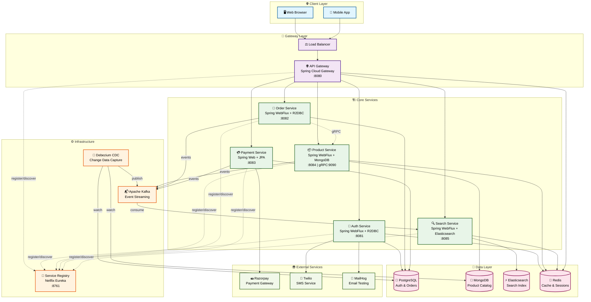

Synapse is a cutting-edge, fully reactive, event-driven e-commerce platform built on a robust microservices architecture. It demonstrates a modern approach to building scalable, resilient, and maintainable enterprise-level applications using Kotlin and the Spring ecosystem.

This project is not just a proof-of-concept; it's a comprehensive backend solution that covers everything from user authentication and product management to complex order processing and advanced search capabilities.

# ✨ Core Features
- **Completely Reactive Stack:** Built from the ground up with Spring WebFlux, Project Reactor, and R2DBC for a non-blocking, high-performance, and scalable system.
- **Guaranteed Event Delivery with CDC:** Services are fully decoupled via **Apache Kafka**. Event publishing is made 100% reliable using the **Outbox Pattern** and **Debezium** for Change Data Capture.
- **Distributed Transaction Management:** Implements the **SAGA Pattern** for managing complex, multi-service transactions like order fulfillment, ensuring data consistency without using blocking protocols.
- **Secure by Design:**
  - Authentication & Authorization: JWT-based security with roles and permissions managed by Spring Security.
  - Two-Factor Authentication (2FA/MFA): TOTP-based 2FA for enhanced user security, complete with QR code generation.
  - Secure Key Management: JWT signing keys are stored securely in a Java Keystore (JCEKS).
- **High-Performance Architecture:**
  - Probabilistic Data Structures: Utilizes **Cuckoo Filters** with Redis to dramatically reduce database load on high-traffic write paths (e.g., checking for unique emails/SKUs).
  - Optimized Endpoints: Key endpoints like user registration and order creation are designed for extremely high RPS and low p99 latency using an "Accept, Offload, and Acknowledge" pattern.
- **Advanced Product & Search:**
  - Full-text, faceted search powered by **Elasticsearch**.
  - Real-time index updates via the Kafka & Debezium event stream.
  - Features like "similar products" and "popular search trends."
- **Robust Data Management:**
  - Polyglot Persistence: Utilizes PostgreSQL for transactional data and MongoDB for flexible product catalogs.
- **Cloud-Native & Resilient:**
  - Service Discovery: Netflix Eureka for dynamic service registration and discovery.
  - Centralized API Gateway: Spring Cloud Gateway handles routing, rate limiting, and API composition.
  - Containerized: Fully containerized with Docker and orchestrated with Docker Compose.
# 🏛️ System Architecture

Synapse employs a state-of-the-art microservices architecture where services are decoupled through an event bus. The system prioritizes availability and resilience, using asynchronous patterns for all critical business flows.

**Architectural Flow**:
* All requests enter through the **API Gateway**, which discovers services via the **Eureka Registry**.
* For write operations (e.g., Create Order), the service performs a single atomic transaction to save its state (e.g., `Order: PENDING`) and write an event record to an outbox table.
* The client immediately receives a `202 ACCEPTED` response.
* Debezium captures the outbox record from the database's transaction log and publishes it reliably to **Apache Kafka**.
* Downstream services consume these events to perform their part of the business process, triggering a **SAGA** for distributed transactions.
* For read operations, the Gateway routes to query services like the **Search Service**, which serves data from its optimized Elasticsearch index.


💡 Design Patterns & Concepts Demonstrated

This project is a practical implementation of several key software architecture and design patterns:

* **Change Data Capture (CDC) & The Outbox Pattern:** This is the core of the event-driven architecture. Instead of services publishing events directly (which can fall), they atomically commit their state and an event record to their own database. Debezium then captures this event from the database's transaction log and guarantees its publication to Kafka. This provides **iron-clad reliability** for event delivery.
* **SAGA Pattern (Choreography-based):** Used for managing distributed transactions, most notably in the order creation process. When an order is placed, a series of events are published by the `Order`, `Payment`, and `Product` services. Each service reacts to events from the others to perform its part of the job. The SAGA includes **compensating transactions** to gracefully handle failures (e.g., automatically refunding a payment if the inventory reservation fails), ensuring data consistency without the need for blocking two-phase commits.
* **CQRS (Command Query Responsibility Segregation):** The system naturally follows a CQRS pattern.
    * **Command Side:** The `Auth`, `Product`, `Order`, and `Payment` services handle all state changes (the commands).
    * **Query Side:** The `Search Service` provides a highly optimized read model, powered by Elasticsearch.
    * **Synchronization:** The Kafka/Debezium pipeline ensures the query side is kept eventually consistent with the command side.
* **Probabilistic Data Structures (Cuckoo Filter):** To optimize high-traffic write endpoints, the system uses a Cuckoo Filter (via RedisBloom). Before hitting the database to check if an email or product SKU exists, the service first queries the Cuckoo Filter. Since the Filter can definitively say if an item *does not exist*, it avoids a costly database query in the majority of cases, significantly reducing latency and load.
* **API Gateway & Service Discovery:** A classic microservices setup using Spring Cloud Gateway and Netflix Eureka for routing and dynamic service discovery.

# Microservices Overview

| Service Name     | Description                                                                                          | Technologies Used                                  | Database      |
|------------------|------------------------------------------------------------------------------------------------------|----------------------------------------------------|---------------|
| Gateway Service  | The single entry point. Handles API routing, rate limiting, and aggregates API documentation.        | Spring Cloud Gateway, WebFlux, Eureka, Redis       | -             |
| Registry Service | Provides service discovery and registration for all microservices.                                   | 	Spring Cloud Netflix Eureka                       | -             |
| Auth Service     | Manages user registration, login, JWT generation, MFA, email verification, and password reset.       | Spring WebFlux, Spring Security, R2DBC, JWT, Redis | PostgreSQL    |
| Product Service  | Core of the catalog. Manages products, categories, brands, sellers, and inventory. Publishes events. | Spring WebFlux, Reactive MongoDB, Kafka, gRPC      | MongoDB       |
| Order Service    | Handles order creation, validation, and processing. Communicates with Product Service via gRPC.      | Spring WebFlux, R2DBC, gRPC, Kafka                 | PostgreSQL    |
| Payment Service  | Integrates with Razorpay for handling payments and processes payment status updates via webhooks.    | Spring Web, JPA, Kafka, Razorpay SDK               | PostgreSQL    |
| Search Service   | Consumes Kafka events to provide powerful, real-time search capabilities for products.               | Spring WebFlux, Reactive Elasticsearch, Kafka      | Elasticsearch |

⚙️ Technology Stack

| Category             | Technologies                                                                    |
|:---------------------|:--------------------------------------------------------------------------------|
| Language & Framework | Kotlin, Spring Boot 3, Spring WebFlux, Spring Security, R2DBC                   |
| Databases & Caching  | PostgreSQL, MongoDB, Elasticsearch, **Redis (with ReBloom for Cuckoo Filters)** |
| Messaging & Events   | Debezium, Apache Kafka, Outbox Pattern                                          |
| Architecture         | Microservices, Event-Driven, SAGA Pattern, CQRS, REST APIs, gRPC, Docker        |
| Cloud & DevOps       | Netflix Eureka (Service Discovery), Spring Cloud Gateway, Resilience4j          |
| Authentication       | JWT (JSON Web Tokens), TOTP (for 2FA)                                           |
| Build Tool           | Gradle                                                                          |

🚀 Getting Started

Prerequisites
-------------
- Git
- JDK 21 or later
- Docker & Docker Compose

1. Configuration
----------------
First, create and populate a `.env` file from the provided example:
```bash
    cp .env.example .env
```
Open the `.env` file and fill in all the required credentials (Postgres, JWT, external APIs).

Next, generate the secure Java Keystore for JWT signing:

    keytool -genseckey -alias jwtKey -keyalg HmacSHA256 -keysize 256 -keystore keystore.jks -storetype JCEKS

Enter the passwords you defined in the `.env` file when prompted.

2. Running the Platform
-----------------------
With Docker and Docker Compose, starting the entire application stack is a single command from the project root:

    docker-compose up --build

This will build and start all services. It may take a few minutes for all containers to become healthy and for Debezium to configure its connectors.

3. Debezium Connector Configuration
-----------------------------------
Once the services are running, you must configure the Debezium connectors to start the CDC stream.

(Provide instructions here on how to POST the JSON configurations for the PostgreSQL and MongoDB connectors to the Debezium Connect API at http://localhost:18083/connectors)

4. Accessing Services
---------------------
- API Gateway: http://localhost:8080
- Eureka Service Registry: http://localhost:8761
- Aggregated API Docs (Swagger UI): http://localhost:8080/swagger-ui.html
- MailHog (Email Testing): http://localhost:8025