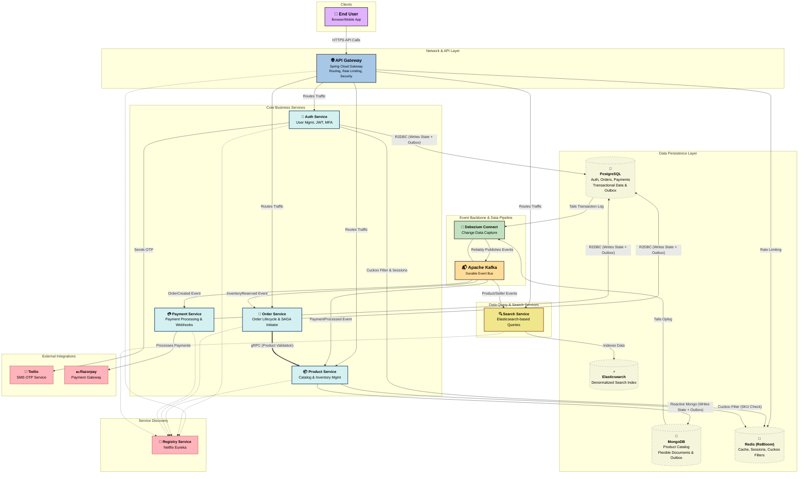

# Synapse E-commerce Platform

Welcome to the Synapse E-commerce Platform, a modern, reactive, and resilient microservices-based application designed to showcase a complete e-commerce workflow. This project is built entirely in Kotlin using the Spring Boot framework and leverages a suite of powerful technologies to deliver a scalable and maintainable system.

## Table of Contents
- [Architecture Overview](#architecture-overview)
- [Core Concepts & Patterns](#core-concepts--patterns)
- [Technology Stack](#technology-stack)
- [Service Breakdown](#service-breakdown)
  - [Gateway Service](#gateway-service)
  - [Registry Service](#registry-service)
  - [Auth Service](#auth-service)
  - [Product Service](#product-service)
  - [Search Service](#search-service)
  - [Order Service](#order-service)
  - [Payment Service](#payment-service)
- [Setup and Running the Project](#setup-and-running-the-project)
- [API Endpoints](#api-endpoints)
- [Security](#security)
- [Codebase Structure](#codebase-structure)

<a id="architecture-overview"></a>
## Architecture Overview

The platform follows a microservices architecture, with each service responsible for a specific business domain. Services communicate asynchronously via a message broker (Kafka) and synchronously via REST and gRPC where appropriate.


<a id="core-concepts--patterns"></a>
## Core Concepts & Patterns

This project is not just a collection of services but an implementation of modern software engineering principles.

-   **Reactive Programming**: The entire stack is built on a non-blocking, reactive foundation using **Spring WebFlux** and **Project Reactor**. This ensures high throughput and scalability under load.
-   **Event-Driven Architecture**: Services are loosely coupled and communicate asynchronously through **Apache Kafka**. This improves resilience and allows services to evolve independently.
-   **Outbox Pattern**: To guarantee data consistency between a service's database and the events it publishes, the Outbox pattern is implemented in the `auth`, `order`, and `product` services. This ensures that an event is published if and only if the corresponding database transaction is successful.
-   **Hexagonal Architecture (Ports & Adapters)**: The codebase for each service is structured to isolate the core domain logic from external concerns.
    -   `domain`: Contains the core business models, logic, and ports (interfaces).
    -   `application`: Orchestrates the use cases by interacting with the domain.
    -   `infrastructure`: Contains the adapters that implement the ports and interact with external systems like databases, message brokers, and third-party APIs.
-   **CQRS (Command Query Responsibility Segregation)**: While not a full implementation, the principle is applied by separating the write-optimized databases (PostgreSQL, MongoDB) from the read-optimized search index (`search-service` with Elasticsearch).
-   **Service Discovery**: **Netflix Eureka** is used as the service registry, allowing services to dynamically find and communicate with each other.
-   **API Gateway**: **Spring Cloud Gateway** provides a single entry point for all client requests, handling routing, rate limiting, and security concerns.

<a id="technology-stack"></a>
## Technology Stack

| Category              | Technology                                                                          |
| --------------------- | ----------------------------------------------------------------------------------- |
| **Language/Framework**| Kotlin 1.9+, Spring Boot 3+ (WebFlux)                                               |
| **Service Mesh**      | Spring Cloud (Gateway, Netflix Eureka)                                              |
| **Databases**         | PostgreSQL (Auth, Order, Payment), MongoDB (Product), Elasticsearch (Search)        |
| **Caching**           | Redis                                                                               |
| **Messaging**         | Apache Kafka                                                                        |
| **Communication**     | REST, gRPC (Order Service <-> Product Service)                                      |
| **Security**          | JWT (JSON Web Tokens), Spring Security                                              |
| **Resilience**        | Resilience4j (Circuit Breaker)                                                      |
| **Third-Party APIs**  | Razorpay (Payments), Twilio (SMS OTP)                                               |
| **API Documentation** | OpenAPI (Swagger)                                                                   |
| **Testing**           | JUnit 5, MockK, Testcontainers, StepVerifier                                        |

<a id="service-breakdown"></a>
## Service Breakdown

<a id="gateway-service"></a>
### Gateway Service
-   **Purpose**: The single entry point for all incoming client traffic.
-   **Features**:
    -   Routes requests to the appropriate downstream service based on path predicates.
    -   Implements IP-based rate limiting using a custom `IpKeyResolver` and Redis to protect against abuse.
    -   Acts as a reverse proxy and can handle SSL termination in a production environment.
-   **Technology**: Spring Cloud Gateway.

<a id="registry-service"></a>
### Registry Service
-   **Purpose**: Allows services to register themselves and discover others.
-   **Features**:
    -   Maintains a registry of all active service instances and their locations.
    -   Enables dynamic scaling and resilience, as services can be added or removed without manual reconfiguration.
-   **Technology**: Spring Cloud Netflix Eureka.

<a id="auth-service"></a>
### Auth Service
-   **Purpose**: Manages user identity, authentication, and access control.
-   **Features**:
    -   Secure user registration with credential validation and login functionalities.
    -   JWT-based token generation (access and refresh tokens) using a secure keystore.
    -   Multi-Factor Authentication (MFA) with TOTP (e.g., Google Authenticator), including QR code generation.
    -   Handles new device logins by requiring email verification.
    -   Secure password reset functionality via email tokens.
    -   Uses Redis for caching tokens, sessions, and implementing rate limiting.
    -   Employs the Outbox pattern to reliably publish a `SellerRegisteredEvent` to Kafka whenever a user with a `SELLER` role registers.
-   **Technology**: PostgreSQL, Redis, Spring Security, JWT, Twilio, Resilience4j.

<a id="product-service"></a>
### Product Service
-   **Purpose**: The source of truth for all product, brand, category, and seller information.
-   **Features**:
    -   Comprehensive CRUD operations for Products, Brands, Categories, and Sellers.
    -   Manages warehouse stock and inventory levels.
    -   Handles file uploads for brand and category logos to a local disk storage.
    -   Initiates seller onboarding by consuming `SellerRegisteredEvent` from Kafka, creating a temporary seller profile that can be fully registered later.
    -   Utilizes the Outbox pattern to publish domain events (e.g., `ProductCreated`, `BrandUpdated`, `CategoryDeleted`) to Kafka, ensuring data consistency.
    -   Exposes a high-performance gRPC endpoint for fast, internal product validation checks required by the `order-service`.
    -   Uses a Redis-backed Cuckoo Filter for probabilistic, low-latency checks of SKU existence to prevent duplicates.
-   **Technology**: MongoDB, Kafka, gRPC, Redis.

<a id="search-service"></a>
### Search Service
-   **Purpose**: Provides a rich, fast, and powerful search experience for products.
-   **Features**:
    -   Full-text search on product names, descriptions, and other attributes.
    -   Advanced faceted search with filtering by category, brand, price range, color, and tags.
    -   "More like this" functionality for recommending similar products.
    -   Keeps its data synchronized with the `product-service` by consuming product-related events from Kafka and updating its Elasticsearch index accordingly.
    -   Caches frequent search queries in Redis to improve performance.
-   **Technology**: Elasticsearch, Kafka, Redis.

<a id="order-service"></a>
### Order Service
-   **Purpose**: Manages the entire lifecycle of customer orders.
-   **Features**:
    -   Handles order creation, updates, and status tracking.
    -   Ensures product validity and stock availability by making a synchronous, high-performance gRPC call to the `product-service` before creating an order.
    -   Uses the Outbox pattern to reliably publish an `OrderCreatedEvent` to Kafka upon successful order creation, which in turn triggers the payment process in the `payment-service`.
-   **Technology**: PostgreSQL, Kafka, gRPC.

<a id="payment-service"></a>
### Payment Service
-   **Purpose**: Handles all payment and refund-related operations.
-   **Features**:
    -   Initiates payment flows by consuming `OrderCreatedEvent` from Kafka.
    -   Integrates with a third-party payment gateway (Razorpay) to create payment orders.
    -   Provides a secure endpoint for processing payment gateway webhooks to handle payment confirmation, failures, and refunds.
    -   Uses Redis for idempotency checks on webhook events.
    -   Employs the Outbox pattern to publish payment status events (`PaymentSuccess`, `PaymentFailure`) back to Kafka for other services to consume.
-   **Technology**: PostgreSQL, Kafka, Redis, Razorpay API.

<a id="setup-and-running-the-project"></a>
## Setup and Running the Project

### Prerequisites
-   Java 17+
-   Docker and Docker Compose
-   An active account with **Twilio** and **Razorpay** to obtain API keys.

### Configuration
1.  **Clone the repository:**
    ```bash
    git clone https://your-repository-url.com/synapse-ecommerce.git
    cd synapse-ecommerce
    ```
2.  **Environment Variables:**
    Each service contains an `application.properties` (or `.yml`) file. You will need to configure the following properties, ideally through environment variables or a `.env` file for Docker Compose.

    **Common:**
    -   `SPRING_PROFILES_ACTIVE=docker`
    -   Database credentials (PostgreSQL, MongoDB)
    -   Redis and Kafka connection details

    **Service-specific:**
    -   `auth-service`: JWT secrets, Twilio SID/Token
    -   `payment-service`: Razorpay Key ID/Secret
    -   `product-service`: Twilio SID/Token

### Building the Project
You can build all services at once from the root directory.
```bash
# From the root directory of the project
./mvnw clean install
```

### Running with Docker Compose
The most convenient way to run the entire platform is with Docker Compose. A `docker-compose.yml` file is provided at the root of the project to build and run all services and their dependencies.

1.  **Create a `.env` file** in the root directory and populate it with all the required configuration properties. A sample `.env.example` can be used as a template.
2.  **Run Docker Compose:**
    ```bash
    docker-compose up --build -d
    ```3.  **To check the logs for a specific service:**
    ```bash
    docker-compose logs -f <service_name>
    # e.g., docker-compose logs -f auth-service
    ```
4.  **To shut down the platform and remove containers:**
    ```bash
    docker-compose down
    ```

<a id="api-endpoints"></a>
## API Endpoints

The API is exposed through the **Gateway Service**, which runs on port `8080`.

| Method | Endpoint                                        | Service           | Description                               | Authorization |
|--------|-------------------------------------------------|-------------------|-------------------------------------------|---------------|
| `POST` | `/api/v1/auth/register`                         | `auth-service`    | Register a new user.                      | `Public`      |
| `POST` | `/api/v1/auth/login`                            | `auth-service`    | Log in and receive JWT tokens.            | `Public`      |
| `POST` | `/api/v1/auth/forgot-password`                  | `auth-service`    | Initiate the password reset process.      | `Public`      |
| `POST` | `/api/v1/products/seller/register`              | `product-service` | Complete seller registration details.     | `SELLER`      |
| `POST` | `/api/v1/products`                              | `product-service` | Create a new product.                     | `SELLER`      |
| `PATCH`| `/api/v1/products/{id}`                         | `product-service` | Update a product.                         | `SELLER`      |
| `DELETE`| `/api/v1/products/{id}`                         | `product-service` | Delete a product.                         | `SELLER`      |
| `POST` | `/api/v1/products/brands`                       | `product-service` | Create a new brand.                       | `SELLER`      |
| `POST` | `/api/v1/products/category`                     | `product-service` | Create a new category.                    | `ADMIN`       |
| `GET`  | `/api/v1/search`                                | `search-service`  | Search for products with filters.         | `Public`      |
| `GET`  | `/api/v1/products/{id}`                         | `search-service`  | Get detailed information about a product. | `Public`      |
| `POST` | `/api/v1/orders`                                | `order-service`   | Create a new order.                       | `CUSTOMER`    |
| `GET`  | `/api/v1/payments/payment-order/{productOrderId}`| `payment-service` | Get Razorpay Order ID for payment.        | `CUSTOMER`    |
| `POST` | `/api/v1/payments/webhook`                      | `payment-service` | Webhook endpoint for Razorpay.            | `Public`      |


<a id="security"></a>
## Security

-   **Authentication**: The platform uses JWT-based authentication. After a successful login, the `auth-service` issues an access token and a refresh token. The client must include the access token in the `Authorization: Bearer <token>` header for all subsequent requests to protected endpoints.
-   **Authorization**: Role-based access control (RBAC) is enforced using Spring Security's method-level security. Endpoints are protected with annotations like `@PreAuthorize("hasRole('SELLER')")` to restrict access based on user roles (e.g., `CUSTOMER`, `SELLER`, `ADMIN`) embedded within the JWT.
-   **Filters**: Each protected microservice includes a `JwtAuthenticationFilter` that intercepts incoming requests, validates the JWT signature and claims using a shared keystore, and populates the Spring Security context with the authenticated user's details.

<a id="codebase-structure"></a>
## Codebase Structure

Each service is a self-contained module and follows the principles of **Hexagonal Architecture** for a clean separation of concerns:

-   **/domain**: The core of the service, containing pure business logic. It has no dependencies on any framework.
    -   `model`: Contains the core business entities, value objects, and enums.
    -   `port/driver`: Interfaces (ports) that define how the application layer drives the domain (i.e., the use cases).
    -   `port/driven`: Interfaces (ports) that define the contracts for external dependencies like databases or message brokers.
-   **/application**: The orchestration layer that implements the use cases.
    -   `service`: Implementations of the driver ports. They coordinate calls to domain objects and driven ports to execute business workflows.
-   **/infrastructure**: The outermost layer containing all technical details and integrations.
    -   `adapter/inbound`: Adapters that drive the application logic, such as REST controllers, gRPC services, and Kafka listeners.
    -   `adapter/outbound`: Adapters that are driven by the application, such as database repository implementations, REST clients, and Kafka producers.

Example structure for `product-service`:
```
product-service/
└── src/main/kotlin/com/ethyllium/productservice/
    ├── domain/
    │   ├── model/
    │   │   └── Product.kt
    │   ├── port/
    │   │   ├── driver/
    │   │   │   └── ProductService.kt
    │   │   └── driven/
    │   │       └── ProductRepository.kt
    ├── application/
    │   └── service/
    │       └── ProductServiceImpl.kt
    └── infrastructure/
        ├── adapter/
        │   ├── inbound/
        │   │   ├── rest/
        │   │   │   └── ProductController.kt
        │   │   └── grpc/
        │   │       └── ProductValidationServerService.kt
        │   └── outbound/
        │       ├── persistence/
        │       │   └── ProductRepositoryImpl.kt
        │       └── kafka/
        │           └── OutboxEntityRepositoryImpl.kt
        └── ProductServiceApplication.kt
```
